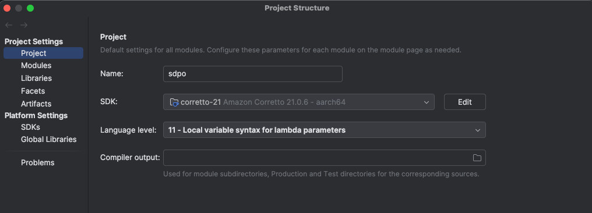
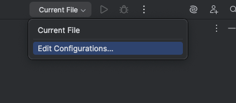
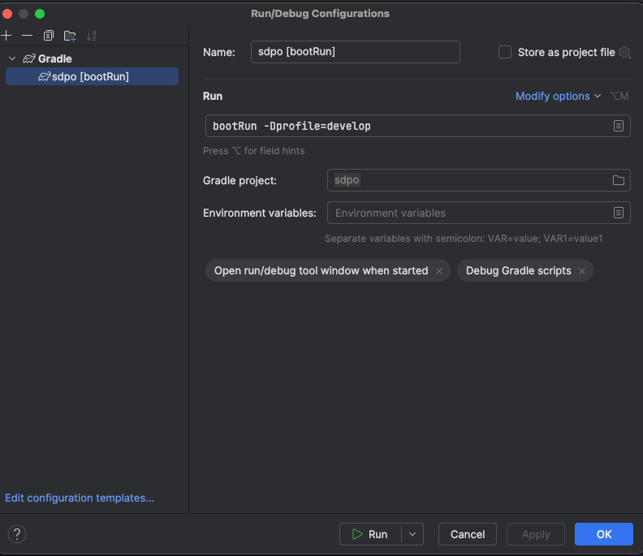

## Запуск приложения
Склонируйте гит репозиторий
```bash
git clone https://github.com/Transavto7/sdpo-java.git
```

#### Запуск для разработки
- Запуск с IntelliJ idea
    1) Откройте проект в ide  
        Установите sdk corretto-21 и дождитесь индексации и импорта проекта
        
    2) В правом верхнем углу выберите пункт `Edit configuration`  
    
    3) Далее выбираем `+` -> `Gradle` и в поле `Run` вставляем `bootRun -Dprofile=develop`  
    
    4) Сохраните настройки и можно запускать приложение для разработки с этим конфигом
- Запуск из терминала (Непроверенный вариант)
    1) Установите java-21
    2) Перейдите в директорию с проектом
    3) Запустите проект 
     ```bash
       ./gradlew bootRun -Dprofile=develop # gradlew.bat для windows пользователей
     ``` 
- По умолчанию приложение попытается подключится к тестовому домену  
Для изменения домена подключения необходимо уточнить домен и токен  
Далее либо ввести данные в настройках, либо изменить напрямую конфигурации  
`~/sdpo/configs/connect.json` для Linux пользователей или `C:\Users\<Your Username>\AppData\Roaming\sdpo\configs\connect.json` для Windows пользователей
- Приложение запускается на localhost:8080, profile=develop означает что приложение запущено для разработки и не будет требовать подключения к периферии

#### Сборка проекта
- С IntelliJ idea  
Добавляем новый конфиг(как при запуске), но в поле `Run` теперь пишем `bootJar -Dprofile=production`
- Из терминала  
 ```bash
   ./gradlew bootJar -Dprofile=production # gradlew.bat для windows пользователей
 ``` 
  
#### Запуск проекта из Jar файла на терминале 
- Заходим в консоль с правами администратора и вводим 
```bash
java -jar <собранный jar файл>
```

#### Запуск на терминале из лаунчера
- Собираем jar файл
- Заходим на домен с версиями СДПО и создаем\обновляем версию  
- Переходим к терминалу и запускаем лаунчер с правами администратора
- В появившемся списке выбираем нужную версию и нажимаем `Скачать`
- Далее станет доступна кнопка `Запустить`


При запуске в профиле production приложение само откроет браузер указанный в настройках. По умолчанию `Microsoft Edge`  
Запуск в профиле production работает только на ОС Windows, так как там используется специфичная для нее api